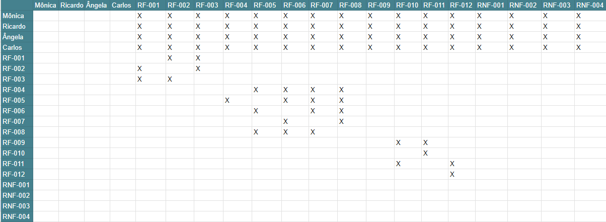

# Especificações do Projeto

A determinação exata do problema, suas personas, requisitos funcionais e não-funcionais foram acordadas em reuniões online entre os membros da equipe. Foram reunidas informações e observações e, complementarmente. Os detalhes levantados nesse processo auxiliaram na construção de personas e histórias de usuários.

## Personas

## Histórias de Usuários

Com base na análise das personas forma identificadas as seguintes histórias de usuários:

|EU COMO... `PERSONA`| QUERO/PRECISO ... `FUNCIONALIDADE` |PARA ... `MOTIVO/VALOR`                 |
|--------------------|------------------------------------|----------------------------------------|
|Carlos Moreira    | Cronometrar o tempo gasto para executar tarefas.| Revisar os conteúdos da prova com mais facilidade.|
|Carlos Moreira    | Ser notificado quando o tempo alocado para a execução de uma tarefa acabar.| Avançar para as próximas tarefas.  |
|Mônica Ribeiro     | Ajustar o tempo gasto em cada tarefa.  | Ter tempo livre aos finais de semana. |
|Ricardo Nunes     | Organizar e controlar tarefas por meio de listas   | Otimizar a entrega de trabalhos dentro do prazo. |
|Ricardo Nunes     | Cadastrar um perfil e acessar regularmente, por meio de login, as informações da lista.| Acompanhar e controlar sua produtividade. |
|Ângela Santos     | Marcar tarefas como concluídas.   | Controlar as tarefas cadastradas. |
|Ângela Santos     | Excluir tarefas desnecessárias.   | Não se preocupar com uma tarefa que não precisa de ser cumprida. |

## Modelagem do Processo de Negócio 

### Análise da Situação Atual

Apresente aqui os problemas existentes que viabilizam sua proposta. Apresente o modelo do sistema como ele funciona hoje. Caso sua proposta seja inovadora e não existam processos claramente definidos, apresente como as tarefas que o seu sistema pretende implementar são executadas atualmente, mesmo que não se utilize tecnologia computacional. 

### Descrição Geral da Proposta

Apresente aqui uma descrição da sua proposta abordando seus limites e suas ligações com as estratégias e objetivos do negócio. Apresente aqui as oportunidades de melhorias.

### Processo 1 – NOME DO PROCESSO

Apresente aqui o nome e as oportunidades de melhorias para o processo 1. Em seguida, apresente o modelo do processo 1, descrito no padrão BPMN. 

### Processo 2 – NOME DO PROCESSO

Apresente aqui o nome e as oportunidades de melhorias para o processo 2. Em seguida, apresente o modelo do processo 2, descrito no padrão BPMN.

## Indicadores de Desempenho

Apresente aqui os principais indicadores de desempenho e algumas metas para o processo. Atenção: as informações necessárias para gerar os indicadores devem estar contempladas no diagrama de classe. Colocar no mínimo 5 indicadores. 

Usar o seguinte modelo: 

Obs.: todas as informações para gerar os indicadores devem estar no diagrama de classe a ser apresentado a posteriori. 

## Requisitos

As tabelas que se seguem apresentam os requisitos funcionais e não funcionais que detalham o escopo do projeto. Para determinar a prioridade de requisitos, aplicar uma técnica de priorização de requisitos e detalhar como a técnica foi aplicada.

### Requisitos Funcionais

A tabela a seguir apresenta os requisitos do projeto, identificando a prioridade em que os mesmos devem ser entregues. 

|ID    | Descrição do Requisito  | Prioridade |
|------|-----------------------------------------|----|
|RF-001  | O software deve apresentar um cronômetro para o controle de tempo. | ALTA | 
|RF-002  | O cronômetro deve possibilitar que o usuário ajuste o tempo no modo manual.   | ALTA |
|RF-003  | O cronômetro deverá possibilitar que o usuário escolha os modos padrões de pomodoro (30 min de tarefa para 10 de descanso, ou 45 de tarefa para 15 de descanso).   | ALTA |
|RF-004  | O software permitirá que o usuário crie uma lista e adicione tarefas.   | ALTA |
|RF-005  | O software permitirá a marcação de tarefas realizadas.   | MÉDIA |
|RF-006  | O software permitirá que as tarefas da lista sejam excluídas.   | ALTA |
|RF-007  | O software permitirá que as tarefas sejam configuradas como recorrentes (diárias, semanais, mensais).   | MÉDIA |
|RF-008  | O software terá uma tela de login. | ALTA |
|RF-009  | O software terá uma tela de cadastro.   | ALTA |
|RF-010  | O software deverá notificar o usuário quando o tempo acabar.   | MÉDIA |
|RF-011  | O site apresentará dicas de descanso e relaxamento.   | BAIXA |

### Requisitos não Funcionais

A tabela a seguir apresenta os requisitos não funcionais que o projeto deverá atender.

|ID     | Descrição do Requisito  |Prioridade |
|-------|-------------------------|----|
|RNF-001| A aplicação deve ser publicada em repositório público acessível na internet (Repl.it, GitHub Pages etc.).| ALTA | 
|RNF-002| Uso de design responsivo nas interfaces gráficas para diferentes tipos de telas de celular, tablet e etc. |  ALTA | 
|RNF-003| Será possível o ajuste de tempo das tarefas ou projetos conforme a necessidade do usuário.  | MÉDIA | 
|RNF-004| O aplicativo deve ser compatível com os principais navegadores do mercado para mobile (Google Chrome, Mozilla Firefox, Microsoft Edge, Safari) |  ALTA | 
|RNF-005| O site não apresentará aos usuários quaisquer dados de cunho privativo e deverá atender às normas legais, tais como padrões LGPD e etc. | ALTA | 

## Restrições

As questões que limitam a execução desse projeto e que se configuram como obrigações claras para o desenvolvimento do projeto em questão são apresentadas na tabela a seguir.

|ID| Restrição                                             |
|--|-------------------------------------------------------|
|RE-01| O projeto necessita ser entregue até 26/06/2023, respeitando o prazo estipulado. |
|RE-02| O projeto deve ser implementado com uso de tecnologias mobile, podendo fazer uso de bibliotecas que influenciam positivamente na qualidade do software.|
|RE-03| O projeto se limita ao desenvolvimento mobile front-end utilizando as linguagens HTML, CSS, JavaScript e React, para que os usuários possam visualizar e interagir com o site na versão mobile.|

## Diagrama de Casos de Uso

O diagrama de classes, ajuda a mapear o projeto, de forma clara e objetiva. Modelando os principais atributos, conexões, suas classes, operações e relações entre objetos.

# Matriz de Rastreabilidade

A matriz de rastreabilidade é uma ferramenta usada para facilitar a visualização dos relacionamentos entre requisitos funcionais e não funcionais e outros artefatos ou objetos, permitindo a rastreabilidade entre os requisitos e os objetivos do projeto. Isto é, através da matriz conseguimos identificar quantos e quais são afetados por qualquer mudança no sistema e no desenvolvimento no escopo do projeto. 

- Com ‘’X’’ estão os requisitos funcionais, não funcionais e o diagrama de classes 

## Siglas:

- | RF-Requisitos Funcionais | RNF- Requisitos não Funcionais | DC-Diagrama de Classes |

# Gerenciamento de Projeto

Observando o cronograma geral dos entregáveis do projeto, figura abaixo, junto aos requisitos, foi possível a criação de um plano de gestão que contempla a gestão de tempo e recursos que serão utilizados durante o projeto.

## Gerenciamento de Tempo

O prazo total para a entrega do projeto é até o dia 23/06/2023, assim seguindo o cronograma geral, foi possível elaborar uma tabela com os marcos de início e fim das tarefas planejadas, conforme abaixo:

|Projeto     | Início  |Fim |
|-------|-------------------------|----|
|Documentação com o Projeto| 20/02/23| 05/03/23 | 
|Modelagem| 10/03/23 |  02/04/23 | 
|Metodologia| 11/03/23  | 02/04/23 | 
|Projeto Interface|12/03/23 |  02/04/23 | 
|Funcionalidades| 23/03/23 | 02/04/23 |
|Programação funcionalidades| 13/04/23 | 07/05/23 |
|Testes de funcionalidades| 30/04/23 | 11/05/23 |

O gráfico de Gantt ou diagrama de Gantt também é uma ferramenta visual utilizada para controlar e gerenciar o cronograma de atividades de um projeto. Com ele, é possível listar tudo que precisa ser feito para colocar o projeto em prática, dividir em atividades e estimar o tempo necessário para executá-las.

## Gerenciamento de Equipe

O gerenciamento adequado de tarefas contribuirá para que o projeto alcance altos níveis de produtividade. Por isso, é fundamental que ocorra a gestão de tarefas e de pessoas, de modo que os times envolvidos no projeto possam ser facilmente gerenciados. 

## Gestão de Orçamento

O processo de determinar o orçamento do projeto é uma tarefa que depende, além dos produtos (saídas) dos processos anteriores do gerenciamento de custos, também de produtos oferecidos por outros processos de gerenciamento, como o escopo e o tempo.

