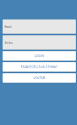

# Template Padrão da Aplicação

Pré-requisitos: <a href="2-Especificação do Projeto.md"> Especificação do Projeto</a>, <a href="3-Projeto de Interface.md"> Projeto de Interface</a>, <a href="4-Metodologia.md"> Metodologia</a>

Layout padrão da aplicação que será utilizado em todas as páginas com a definição de identidade visual, aspectos de responsividade e iconografia.

Por se tratar de uma aplicação mobile, adotamos um estilo visual muito encontrado em aplicativos de uso padrão do nosso cotidiano.

# 1.0 Tela Inicial

# 2.0 Tela de Login

# 3.0 Tela de cadastro

# 4.0 Tela Editar Perfil

# 5.0 Relógio-Pomodoro

# 6.0 Relógio-Cronômetro

# 7.0 Tarefas-Cronômetro

# 8.0 Tarefas-Timer

# 9.0 Tarefas

